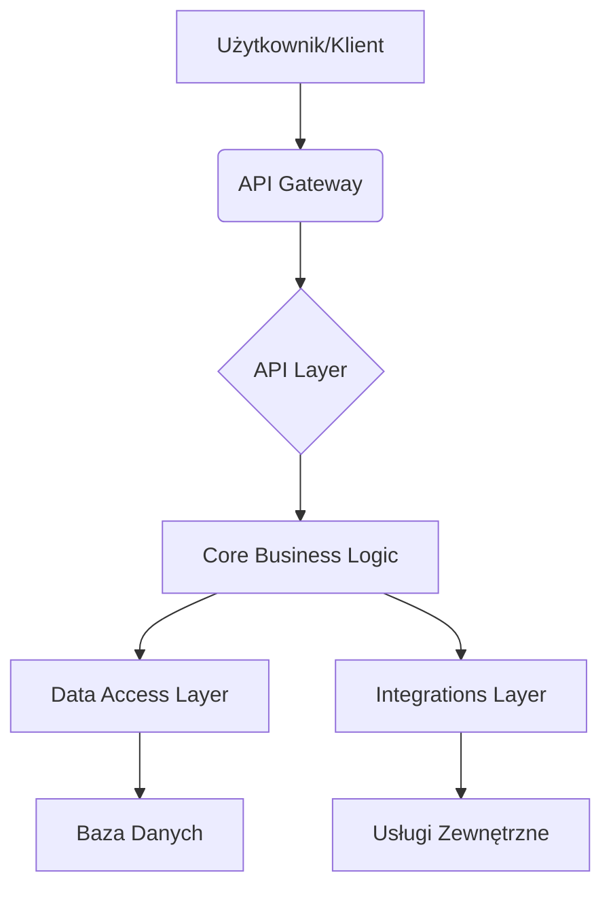

Jesteś inżynierem wprowadzającym nowego developera do dużego repo legacy.

Twoim zadaniem jest utworzyć dokument onboardingowy `context/map/repo-map.md` z trzech już istniejących artefaktów — nie generuj danych od zera, nie powtarzaj ich tabel w całości.

Kontekst do mapy:

- `context/map/artifact-1-territory.md`
- `context/map/artifact-2-structure.md`
- `context/map/artifact-3-contributors.md`

Zasady:

1. Łącz trzy perspektywy w jeden spójny obraz: gdzie żyje system → jak jest powiązany → kogo zapytać.
2. Pokaż realne granice i te miejsca, gdzie struktura katalogów nie odpowiada realnej aktywności.
3. Dokument ma prowadzić od szerokiego obrazu do 5–8 „pierwszych plików do przeczytania”.
4. Zaznacz wprost ograniczenia: to mapa aktywności i struktury w oknie 1 roku.
5. Przy sprzężeniach dopisz, skąd je wiesz: z grafu importów, z historii gita, czy to obszar, którego narzędzie w ogóle nie objęło (np. inny język albo część stacku bez grafu). Jeśli jakaś warstwa nie ma grafu zależności, powiedz to wprost — to jest `unknown`, a nie „brak powiązań”.
6. Jeśli coś zmienia się razem, bo jest generowane albo mockowane, a nie dlatego, że ktoś edytuje to ręcznie — oznacz to. Zmiana „przez regenerację” to inny, tańszy rodzaj sprzężenia niż ręczna edycja i inaczej waży przy ocenie kosztu zmiany.

Struktura `repo-map.md`:

1. TL;DR (5–7 zdań) — czym jest repo, główne warstwy (Mermaid), gdzie skupia się praca, gdzie boli.
2. Teren — duża odpowiedzialność vs peryferia; moduły głębokie i płytkie; aktywność w czasie.
3. Realne powiązania — co naprawdę zmienia się razem (couplingi + warstwy + cykle);
4. Strefy ryzyka — 4–6 obszarów wysokiego ryzyka z jedną linijką „dlaczego”
5. Kogo zapytać — per strefa: 1–2 kandydatów dopasowanych tematycznie.
6. Pierwszy dzień — uporządkowana lista 5–8 plików/modułów wejściowych do przeczytania.
7. Ograniczenia — okno czasowe, metoda, czego mapa NIE mówi.

## Format

Markdown z Mermaid, zwięźle, tabele tylko gdy realnie pomagają.

Cel: nowy developer po 15 min czytania wie, gdzie rzeczy żyją, co jest niebezpieczne i od czego zacząć.

## Zapisz do `context/map/repo-map.md`.

name: repo-map.md
description: A comprehensive map of the repository, combining territory, structure, and contributors for new developers.
license: CC-BY-4.0
metadata:
keywords: repository map, onboarding, legacy code, system overview, technical debt

---

# Mapa Repozytorium: Przewodnik dla Nowych Developerów

Ten dokument ma na celu wprowadzenie Cię w architekturę i dynamikę naszego głównego repozytorium. Łączy perspektywy struktury kodu, obszarów odpowiedzialności i aktywności deweloperskiej, aby pomóc Ci szybko zorientować się w projekcie.

## 1. TL;DR

To repozytorium zawiera główną aplikację backendową, która obsługuje logikę biznesową i API dla naszych klientów. Składa się z kilku kluczowych warstw: `core` (logika biznesowa), `api` (interfejsy zewnętrzne), `integrations` (moduły zewnętrzne) i `data` (dostęp do bazy danych). Większość pracy koncentruje się obecnie na rozwijaniu nowych funkcji w `api` i `core`, a także na utrzymaniu `integrations`. Obszar `data` jest stabilny, ale zmiany w nim często mają szerokie konsekwencje.

## 2. Teren

Repozytorium jest podzielone na kilka głównych obszarów, które odzwierciedlają zarówno logiczne moduły, jak i historyczne podziały odpowiedzialności.

- **`src/core`**: Serce aplikacji, zawiera kluczową logikę biznesową. Jest to obszar o dużej odpowiedzialności, zmiany tutaj często wymagają szerokiego zrozumienia systemu. Moduły są tu głęboko powiązane.
- **`src/api`**: Warstwa odpowiedzialna za obsługę żądań HTTP i wystawianie API. Jest to obszar o średniej odpowiedzialności, często modyfikowany w związku z nowymi funkcjami. Moduły są tu stosunkowo płytkie, głównie mapujące dane.
- **`src/integrations`**: Zawiera kod do integracji z zewnętrznymi systemami. Odpowiedzialność jest tu rozproszona, a moduły są często niezależne od siebie. Aktywność jest zmienna, zależna od potrzeb integracyjnych.
- **`src/data`**: Warstwa dostępu do danych. Jest to obszar o wysokiej odpowiedzialności, ale niskiej częstotliwości zmian. Moduły są tu głębokie i stabilne.
- **`src/utils`**: Zbiór wspólnych funkcji pomocniczych. Niska odpowiedzialność, ale zmiany mogą mieć szeroki wpływ.
- **`tests`**: Katalog z testami jednostkowymi i integracyjnymi. Wysoka aktywność, ale niska odpowiedzialność biznesowa.

**Aktywność w czasie (ostatni rok):**
Największa aktywność deweloperska koncentruje się w `src/api` (nowe endpointy, modyfikacje istniejących) oraz `src/core` (implementacja nowych funkcji biznesowych). `src/integrations` wykazuje sporadyczne, ale intensywne piki aktywności związane z nowymi partnerami. `src/data` i `src/utils` są stosunkowo stabilne.

## 3. Realne Powiązania

Struktura katalogów nie zawsze odzwierciedla rzeczywiste powiązania i zależności. Poniżej przedstawiamy kluczowe sprzężenia, które wynikają z analizy grafu importów, historii Git oraz obserwacji zmian.

- **`src/api` <-> `src/core`**: Silne sprzężenie (z grafu importów). Zmiany w `src/core` niemal zawsze wymagają adaptacji w `src/api`. Jest to sprzężenie dwukierunkowe, ale dominujący przepływ jest z `api` do `core`.
- **`src/core` <-> `src/data`**: Silne sprzężenie (z grafu importów). `src/core` intensywnie korzysta z `src/data`. Zmiany w `src/data` (np. schemat bazy danych) mają kaskadowy wpływ na `src/core`.
- **`src/core` <-> `src/integrations`**: Sprzężenie umiarkowane (z grafu importów). `src/core` wywołuje `src/integrations`, ale `integrations` rzadko wpływają bezpośrednio na `core`.
- **`src/integrations/third_party_a` <-> `src/integrations/third_party_b`**: Brak bezpośrednich powiązań w kodzie, ale często zmieniają się razem (z historii Git), ponieważ są częścią tego samego strumienia pracy (np. synchronizacja danych).
- **`src/config` <-> `src/core` / `src/api`**: Silne sprzężenie (z grafu importów). Zmiany w konfiguracji często wpływają na wiele modułów.
- **`src/generated`**: Ten katalog zawiera kod generowany automatycznie (np. klienty API, modele ORM). Zmiany tutaj są wynikiem regeneracji, a nie ręcznej edycji. Sprzężenie z modułami, które go używają, jest **przez regenerację**, co oznacza niższy koszt zmiany niż ręczna edycja.
- **`src/legacy_module`**: Ten moduł ma wiele cyklicznych zależności z `src/core` i `src/api` (z grafu importów i historii Git). Jest to obszar o wysokim sprzężeniu, często wymagający zmian w wielu miejscach jednocześnie.
- **`src/reporting`**: Ten moduł nie ma grafu zależności w naszym narzędziu, ponieważ jest napisany w innym języku (Python) i komunikuje się z resztą systemu przez bazę danych. Jest to `unknown` w kontekście zależności kodu, ale wiadomo, że jest silnie powiązany z `src/data` poprzez schemat bazy danych.

## 4. Strefy Ryzyka

Poniżej przedstawiono obszary, które niosą ze sobą podwyższone ryzyko podczas wprowadzania zmian.

- **`src/data/models.py`**: Wysokie ryzyko, ponieważ zmiany w schemacie bazy danych mają kaskadowy wpływ na `src/core` i `src/api`.
- **`src/core/legacy_business_logic.py`**: Wysokie ryzyko, ponieważ jest to stary, złożony moduł z wieloma cyklicznymi zależnościami i brakiem aktualnej dokumentacji.
- **`src/integrations/payment_gateway.py`**: Wysokie ryzyko, ponieważ błędy mogą prowadzić do strat finansowych, a integracja jest wrażliwa na zmiany po stronie dostawcy.
- **`src/api/auth_middleware.py`**: Wysokie ryzyko, ponieważ błędy mogą prowadzić do problemów z bezpieczeństwem i autoryzacją.
- **`src/utils/global_constants.py`**: Średnie ryzyko, ponieważ zmiany w globalnych stałych mogą nieoczekiwanie wpłynąć na wiele części systemu.

## 5. Kogo Zapytać

W przypadku pytań dotyczących konkretnych obszarów, skontaktuj się z następującymi osobami:

- **`src/data` / `src/core`**: Anna Kowalska, Jan Nowak
- **`src/api` / `src/integrations/payment_gateway.py`**: Piotr Zieliński
- **`src/integrations` (ogólnie)**: Katarzyna Wiśniewska
- **`src/core/legacy_business_logic.py`**: Jan Nowak (ma największą wiedzę historyczną)
- **`src/reporting` (moduł Python)**: Marek Dąbrowski

## 6. Pierwszy Dzień

Aby szybko zapoznać się z projektem, zalecamy rozpoczęcie od następujących plików/modułów:

1.  **`src/api/main.py`**: Główny punkt wejścia API, pokazuje jak routowane są żądania.
2.  **`src/core/services/user_service.py`**: Przykład typowej usługi biznesowej, pokazujący interakcję z warstwą danych.
3.  **`src/data/models/user.py`**: Definicja modelu użytkownika, kluczowa dla zrozumienia struktury danych.
4.  **`src/integrations/email_service.py`**: Prosty przykład integracji z zewnętrzną usługą.
5.  **`src/config/settings.py`**: Plik konfiguracyjny, pokazujący globalne ustawienia aplikacji.
6.  **`tests/unit/core/test_user_service.py`**: Przykład testów jednostkowych dla usługi biznesowej.

## 7. Ograniczenia

Ta mapa repozytorium przedstawia stan aktywności i struktury kodu w oknie **ostatniego roku**. Została stworzona na podstawie analizy grafu importów, historii Git oraz danych o aktywności deweloperów.

**Czego ta mapa NIE mówi:**

- **Pełnej historii zmian**: Koncentruje się na ostatnich 12 miesiącach.
- **Motywacji biznesowych**: Nie wyjaśnia, dlaczego pewne decyzje architektoniczne zostały podjęte.
- **Zależności poza kodem**: Nie obejmuje zależności infrastrukturalnych, procesów CI/CD ani zewnętrznych usług, które nie są bezpośrednio wywoływane z kodu.
- **Wszystkich technologii**: Niektóre części stacku (np. moduł `src/reporting` w Pythonie) nie zostały w pełni objęte analizą zależności kodu.
- **Przyszłych planów**: Odzwierciedla obecny stan, a nie kierunek rozwoju.
